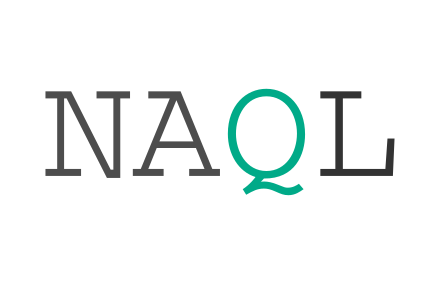

  

### Not Another Query Language

While it's a common problem to specify query string format for RESTful API, there are a few existing solutions, such as FIQL, RSQL and RSQL. All of them are compliant with [URL syntax](https://tools.ietf.org/html/rfc3986), however they're not RESTful mostly.

The idea of NAQL is to provide a recomedations on RESTful API query design, but also being quite flexible to adapt to various API specifications. This package consists of two parts:

- [NAQL specification](./spec);
- [Node.js library](./lib) (could be easily ported), which includes the parser from NAQL query string to JSON format, stringifier from JSON structure to NAQL and the converter to SQL query.
